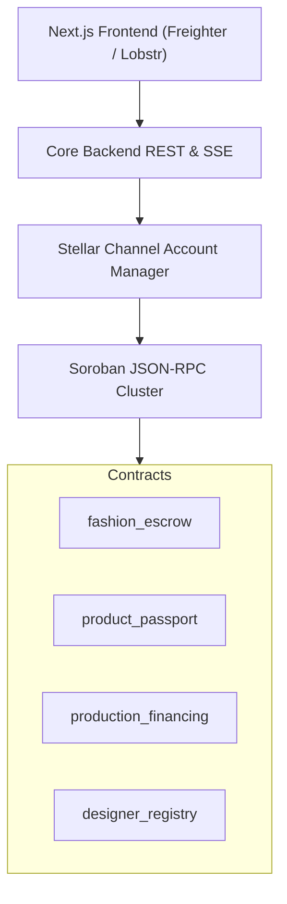
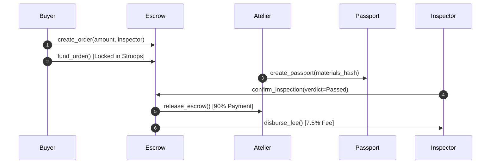

# Stellar Threads Architecture & Dataflow Diagrams

## 1. System Component Hierarchy

```mermaid
flowchart TD
    Client["Next.js Frontend (Freighter / Lobstr)"] --> API["Core Backend REST & SSE"]
    API --> ChannelPool["Stellar Channel Account Manager"]
    ChannelPool --> SorobanRPC["Soroban JSON-RPC Cluster"]
    SorobanRPC --> Contracts["Protocol 22 Smart Contracts"]

    subgraph Contracts
        Escrow["fashion_escrow"]
        Passport["product_passport"]
        Financing["production_financing"]
        Registry["designer_registry"]
    end
```

## 2. 4-Stage Milestone Escrow Progression

```mermaid
sequenceDiagram
    autonumber
    Buyer->>Escrow: create_order(amount, inspector)
    Buyer->>Escrow: fund_order() [Locked in Stroops]
    Atelier->>Passport: create_passport(materials_hash)
    Inspector->>Escrow: confirm_inspection(verdict=Passed)
    Escrow->>Atelier: release_escrow() [90% Payment]
    Escrow->>Inspector: disburse_fee() [7.5% Fee]
```
